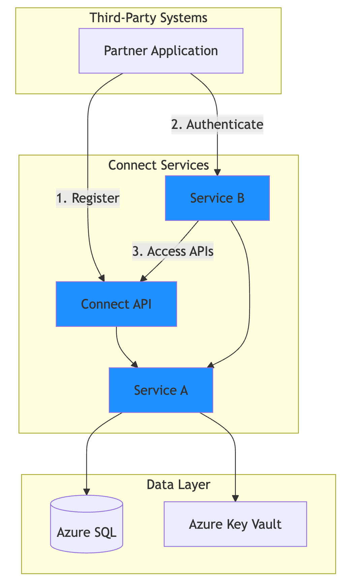
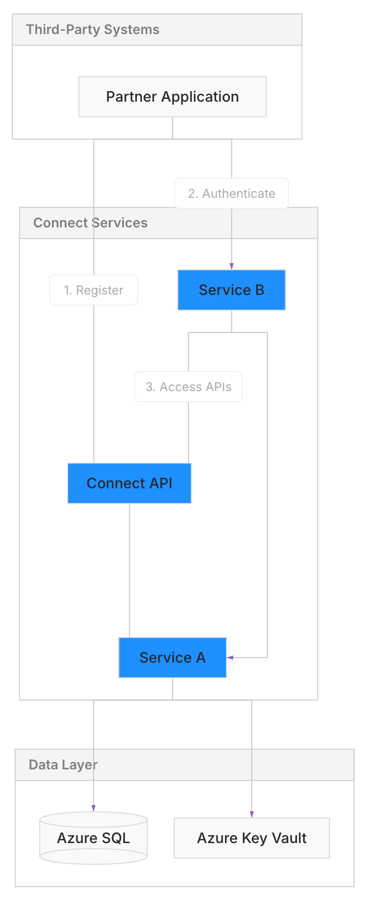
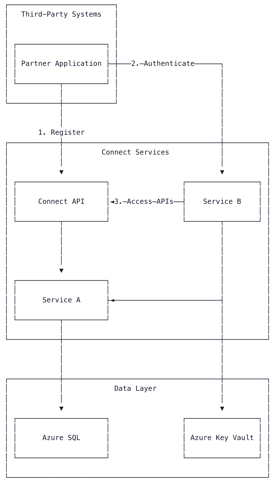

# A better mermaid renderer

## Comparison

|               | Mermaid.live                                                   | Beauty Mermaid                                               | ASCII                                                       |
| ------------- | -------------------------------------------------------------- | ------------------------------------------------------------ | ----------------------------------------------------------- |
| Preview       |                        |                  |                                   |
| Rendering     | Default Mermaid.js styling with bold colors and rounded shapes | Clean, minimal design with soft layout and modern aesthetics | Plain-text representation using box-drawing characters      |
| Readability   | Busy visuals can be hard to follow in complex diagrams         | Clear hierarchy with balanced spacing and subtle styling     | Good for inline documentation but limited for complex flows |
| Customization | Limited to built-in Mermaid themes                             | Full control over styling and layout                         | No styling — text only                                      |
| Use case      | Quick browser-based previews                                   | Polished diagrams for presentations and documentation        | Terminal output, code comments, plain-text docs             |

## How to deploy

See the [Self-Hosted Deployment Guide](DEPLOY.md) for instructions on running with Docker.
